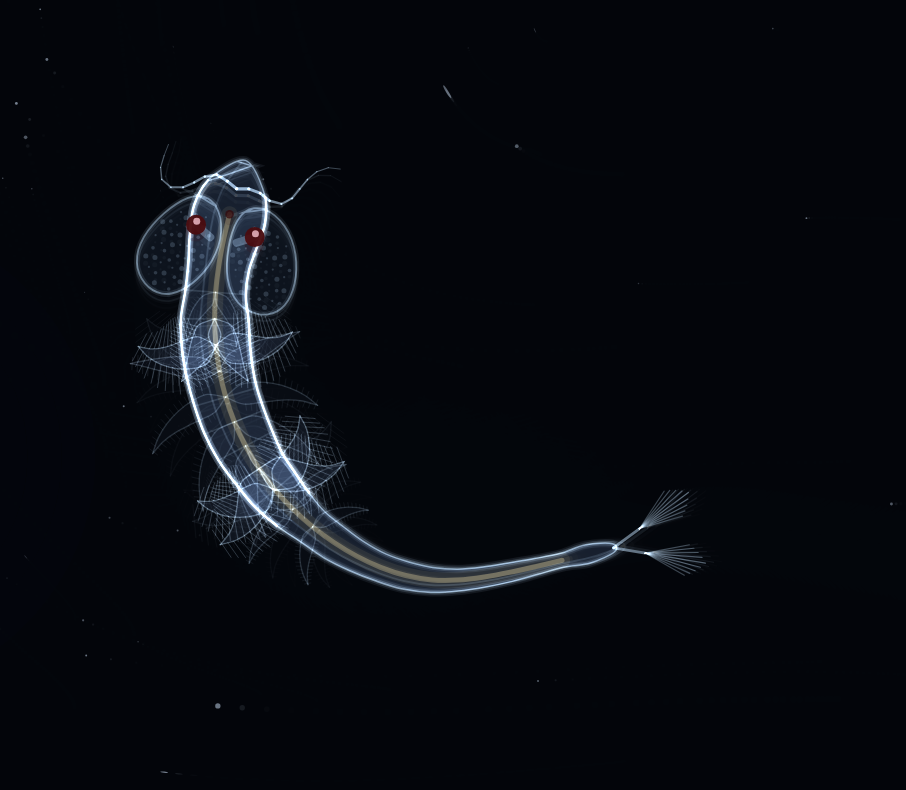
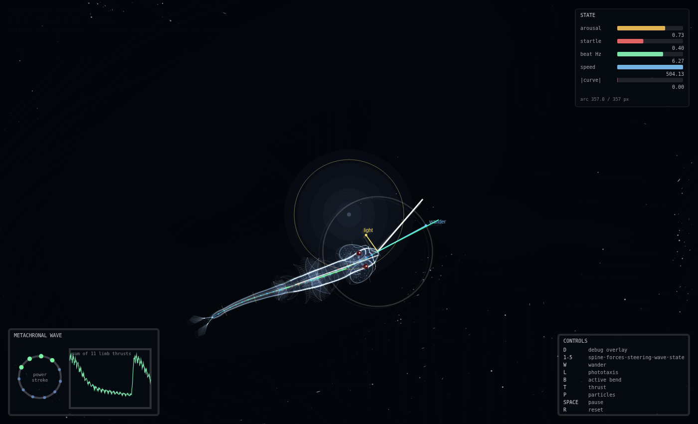
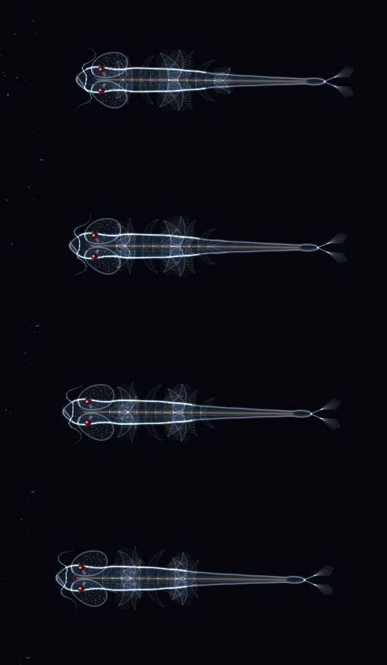

# Computational Sea-Monkey

A procedural *Artemia* (brine shrimp) simulation in p5.js, built to answer one
question:

> **What is the simplest mathematical model capable of producing movement that
> feels convincingly alive?**

Every visible behaviour emerges from a mathematical system. There is no
keyframed animation anywhere in the project — no `sin(t)` in the renderer that
the simulation does not know about. The body is a constrained particle chain;
the legs are eleven phase-shifted paddles; the creature turns by bending, and
the bend has to physically work.



---

## Run it

ES modules need to be served over HTTP, so:

```bash
python3 -m http.server 8000     # or: npx serve
```

then open <http://localhost:8000>. p5.js is vendored in `vendor/`, so there is
nothing to install and it works offline.

## Interact

The pointer is a **light source**, not a handle. You can influence the creature;
you cannot move it. That constraint is deliberate — an organism you can drag is
a puppet, and something that makes its own decisions in response to you is far
more convincing than something that obeys.

| input | effect |
|---|---|
| move the pointer | a light the creature is drawn toward |
| move it fast | a looming stimulus — startles it |
| click | a mechanical disturbance; raises arousal |

## See the mathematics

Press **D**. Every system can be isolated and filmed independently.

| key | |
|---|---|
| `D` | debug overlay |
| `1`–`5` | spine · forces · steering · wave · state |
| `W` `L` `B` `T` | toggle wander / phototaxis / active bend / thrust |
| `P` `H` | particles / HUD |
| `SPACE` `N` | pause / single step |
| `R` | reset |
| `[` `]` | slow down / speed up time |



The overlay reads the *same* numbers the physics ran on — it never recomputes
anything of its own. Worth watching: the **metachronal phase wheel** and the
thrust trace beside it, which show eleven fully intermittent limb forces summing
to a nearly constant total. That smoothing is the reason metachrony exists, and
it is emergent here rather than imposed.

Four frames spanning most of one beat cycle, top to bottom — the wave travels
along the thorax, and nothing in the code moves it there:



---

## Architecture

Behaviour and mathematics are strictly separated from rendering. Nothing in
`core/` or `creature/` imports p5, which means the whole organism runs headless
in Node — that is how it was tuned, by measurement rather than by eye.

```
src/
  config.js              every tunable number, annotated by behaviour
  core/                  organism-agnostic mathematics — no p5, no rendering
    vec2.js              2D vectors
    noise.js             seeded Perlin / fBm
    mathx.js             easing, angles, critically damped springs
    chain.js             the soft-body solver: drag, constraints, elastic beam
    medium.js            ambient flow field (curl of a Perlin potential)
  creature/              behaviour — still no p5
    morphology.js        shape and proportions, measured off the reference
    locomotion.js        the metachronal wave and its thrust
    steering.js          wander, phototaxis, edge avoidance, two actuators
    arousal.js           the slow motor-drive state
    seaMonkey.js         wiring and force bookkeeping
  render/                everything that touches a canvas
    darkfield.js         glow, curves, persistence, vignette
    creatureRenderer.js  the animal
    particles.js         suspended debris
    debugOverlay.js      the mathematics, drawn
  interaction.js         the only place the outside world touches the model
  main.js                canvas, fixed-timestep loop
docs/MODEL.md            the full experiment write-up
```

Adding a second organism means a new `Morphology` and a new renderer. The chain,
the metachronal drive, the steering and the arousal systems are unchanged.

---

## What the measurements said

Full detail, including the several things that turned out to be wrong, is in
**[docs/MODEL.md](docs/MODEL.md)**. The short version:

- **Metachrony is a smoothing device, worth a factor of 35.** Eleven
  individually intermittent limb forces — each delivering, at its peak, ~82 % of
  the animal's whole mean thrust — sum to a total that ripples by 19 %. Beating
  in unison instead ripples by 673 %. The central hypothesis, confirmed by
  sweeping the wavelength. A bonus result: even phase spacing is *not*
  sufficient, because the limbs are tapered and the powerful middle pairs must
  be spread around the cycle rather than assigned adjacent phases.
- **Anisotropic drag is the highest-value line in the project.** Water resisting
  a slender body more across than along is what makes an undulating body go
  forwards instead of skidding. Equalise the two coefficients and the illusion
  collapses instantly.
- **Quadratic thrust needs quadratic drag.** A paddle's thrust goes as *f²*;
  against linear drag, so does speed, and a burst became absurd. Adding form
  drag — the correct regime at Re of a few hundred — gives glide 0.05, cruise
  0.65 and burst 1.92 body lengths/s, which matches published Artemia figures
  without having been fitted to them.
- **Shortening the timestep made the solver worse, not better.** Position-Based
  Dynamics derives velocity as `(p − p_prev)/h`, which amplifies every
  constraint correction by `1/h`. Substepping fixed the stiff bending beam and
  simultaneously made the distance solver crack the abdomen like a bullwhip.
  Cancelling relative velocity with impulses instead is timestep-independent,
  and the two systems stopped fighting. Segment-length error is now 0.02 %,
  holding over a five-minute soak.
- **A uniformly flexible body buckles.** The thorax carries the reaction of
  eleven limb pairs in compression. Stiff thoracic box, soft abdomen — the fix
  and the anatomy are the same thing.
- **The steering couple was inert** until it was expressed as a fraction of the
  animal's own thrust rather than as an absolute force.
- **Buoyancy was conceptually wrong.** This is a top-down microscope view;
  gravity points into the screen. It was replaced by an ambient current shared
  by the creature *and* the debris, which is a much stronger cue that they are
  in the same fluid.

## Reproduce the measurements

```bash
node tools/measure.mjs              # gaits, metachrony, bending, behaviour, soak
node tools/measure.mjs metachrony   # one suite
node tools/measure.mjs sweep limbs.thrustGain 0.012,0.022,0.03
```

No canvas involved — `core/` and `creature/` import nothing from p5, so the
organism runs in Node. Every figure quoted above comes from this harness.

## What is still missing

Also in MODEL.md, with proposed models. Briefly, in priority order: the
simulation is 2-D and the animal rolls; the metachronal wave is an imposed clock
where it should be a chain of coupled oscillators (which would make turning
emergent rather than actuated); and phototaxis is a control loop where the
animal almost certainly compares brightness between its two eyes.
