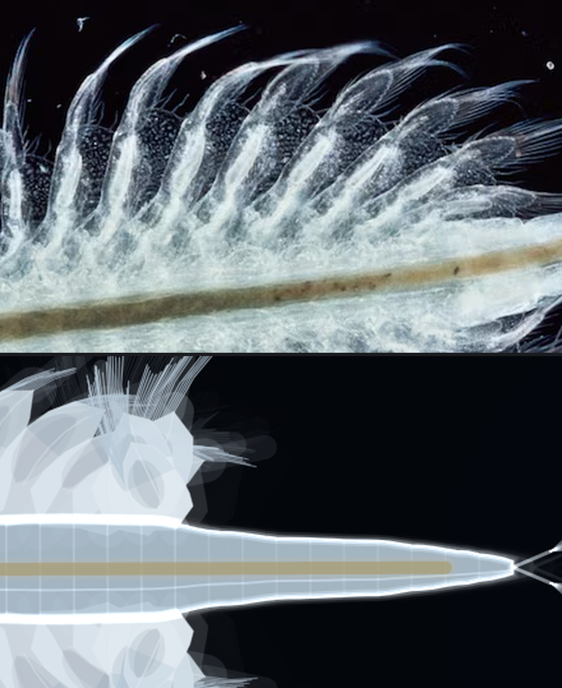
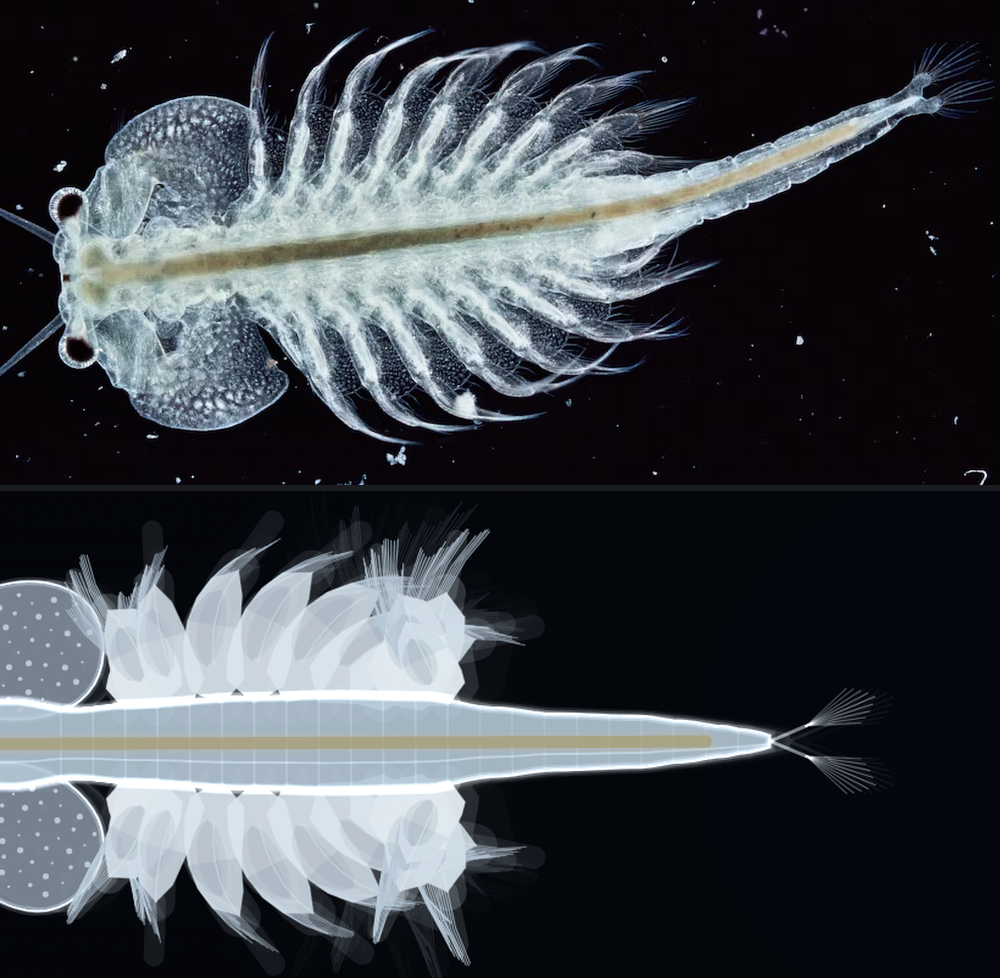

# The model

A record of the experiment: what was observed, what was hypothesised, what was
implemented, what the measurements said, and what is still wrong.

The guiding question was not "how do I draw a brine shrimp" but:

> What is the simplest mathematical model capable of producing movement that
> feels convincingly alive?

Everything below is organised around that. Where a simpler model was found to be
sufficient it was kept; where a simpler model was found to be *insufficient*,
the measurement that showed it is recorded, because those are the interesting
results.

---

## 0. Method

Behaviour was developed headless. `src/core` and `src/creature` import nothing
from p5, so the whole organism runs in Node with no canvas, which made it
possible to sweep parameters and measure outcomes instead of eyeballing them.
The metrics used throughout:

| metric | what it detects |
|---|---|
| `arcLength` drift vs nominal | constraint solver losing; body visibly stretching |
| `align` = v̂ · ĥ | whether the animal moves *forwards* or slides sideways |
| speed in body lengths/s | comparability with published Artemia figures |
| speed ripple | surging vs gliding |
| total body bend, degrees | over-flexing; buckling |
| max node speed | instability, before it becomes visible |

Several of the conclusions below reversed an earlier belief. Those are marked
**correction**, because they are the parts that were actually learned rather
than assumed.

---

## 1. The body

### Observed
The animal is a slender, flexible, strongly tapered tube. The head is heavy and
leads. The abdomen carries no propulsion at all and *trails* — through a turn it
swings wide and settles afterwards. Nothing about the body is rigid, and nothing
about it is floppy.

### Hypothesis
If the body is modelled as a chain of point masses with realistic mass
distribution and realistic drag, then the head-leads/abdomen-trails behaviour
does not need to be authored. It should fall out.

It does. `enabled.thrust` and the steering toggles can all be switched off and
the body still behaves like a body.

### Implementation — `core/chain.js`

Three pieces of mathematics, in descending order of how much they matter.

**1. Anisotropic drag.** The single highest-value line in the project.

```
v = v_t·exp(−k_t·dt)/(1 + q_t·|v_t|·dt) + v_n·exp(−k_n·dt)/(1 + q_n·|v_n|·dt)
```

where `v_t` is the component of a node's velocity along the local body axis and
`v_n` the component across it, with `k_n ≫ k_t`. Water resists a slender body
far more across its length than along it. This is what makes an undulating body
go *forwards* rather than skid. Set the two coefficients equal and the creature
instantly reads as a paper cutout sliding on ice — it is worth doing once just
to see how completely the illusion depends on it.

**2. Inextensibility, in two passes.** A position pass removes accumulated
stretch; a velocity pass cancels relative velocity along each segment with an
equal-and-opposite impulse.

**3. Bending as a damped elastic beam** with a *writable* rest curvature:

```
F = −m_eff · L · (ω²·(θ − θ_rest) + 2ζω·θ̇)
```

applied to the two neighbours and reacted on the centre node, so it is pure
torque. The rest curvature is what the steering system writes to when the animal
bends into a turn.

### Corrections found by measurement

**Correction 1 — bending must not be a position constraint.** The first version
solved bending the way Position-Based Dynamics solves everything: project
positions, then re-derive velocity as `(p − p_prev)/h`. It exploded within three
timesteps. The reason is that the bend solver moves nodes by an appreciable
fraction of a segment length, and the velocity re-derivation turns that into
hundreds of px/s out of nowhere, which feeds the next step.

**Correction 2 — and this is the one worth remembering — shortening the
timestep made it worse.** Substepping is the standard cure for a stiff spring,
and it did stabilise the *bending*. But `(p − p_prev)/h` amplifies every
positional correction by `1/h`, so at `h = 1/1920` the *distance* solver's
sub-pixel corrections became thousands of px/s. The light abdomen cracked like a
bullwhip and the animal tore itself apart at 23 seconds. Two systems that were
each individually fine were fighting through the velocity update.

The fix was to stop deriving velocity from positions at all, and cancel relative
velocity with impulses instead — which is timestep-independent, so the two
systems stopped interacting. Measured segment-length error after the change: **0.02 %**, holding over a
five-minute soak, at any substep count.

**Correction 3 — uniform stiffness buckles.** The thorax carries the reaction of
eleven pairs of beating limbs and is in compression the whole time the animal is
swimming. With uniform bending stiffness it buckled into an S-kink at the
shoulder. A stiffness profile — stiff thoracic box, soft abdomen — is both the
fix and the anatomically correct model. It is also what lets the abdomen stay
whippy, which is the most recognisable thing about how Artemia moves.

---

## 2. Propulsion — the metachronal wave

### Observed
The animal does not flap. Eleven pairs of leaf-shaped legs beat in a travelling
wave, each pair slightly out of phase with the one ahead. The animal glides at a
near-constant speed with no visible lunge, even though every individual leg is
producing a violently intermittent force.

### Hypothesis
**That smoothness is the reason metachrony exists.** If N paddles each produce a
pulse of thrust and their phases are spread evenly around the cycle, the sum is
nearly constant: the ripple is a mechanism for converting a jerky force into a
steady one. So the model should not be "apply a forward force" — it should be
"sum eleven phase-shifted paddle forces" and let the smoothness emerge.

### Implementation — `creature/locomotion.js`

```
φ_i = 2πft − i·Δφ                          phase of limb pair i
ψ_i = φ_i + k·sin(φ_i)                     stroke asymmetry (phase warp)
θ_i = bias + A·sin(ψ_i)                    limb angle
θ̇_i = A·cos(ψ_i)·ω·(1 + k·cos(φ_i))       chain rule
S_i = feather + (1−feather)·smoothstep(θ̇_i) blade area
F_i = c·S_i·(r_i θ̇_i)·|r_i θ̇_i|           quadratic drag on a paddle
```

Two details carry the model:

- **The phase warp.** A pure sine sweeps out and back at the same speed. Warping
  the phase with `ψ = φ + k·sin(φ)` — the same trick as the Kepler equation —
  skews the sinusoid in time without introducing harmonics, giving a fast power
  stroke and a slow recovery for the cost of one extra sine.
- **Feathering.** Blade area is phase-dependent: setae fan on the power stroke
  and fold on the recovery. This is where the net thrust actually comes from.
  Asymmetric *speed* alone is not enough, because drag is quadratic and would
  very nearly cancel.

Thrust is applied **at each limb's own attachment region**, along the local body
axis — not at the centre of mass. A curved body therefore swims a curved path
without anything being told to do so.

### Measurement

Sweeping beat frequency and integrating over many cycles:

| | mean total thrust | peak from one limb | ripple in the sum |
|---|---|---|---|
| glide, 2.6 Hz | 2 283 | 1 881 | 19 % |
| cruise, 5.4 Hz | 35 747 | 29 439 | 19 % |
| burst, 9.0 Hz | 155 143 | 127 752 | 19 % |

**The hypothesis holds, and more strongly than expected.** A single limb's
thrust is fully intermittent, and at its peak it delivers ~82 % of the whole
animal's mean thrust on its own — yet the sum of eleven ripples by only 19 %,
and that residual sits at N·f rather than f.

Sweeping the wavelength makes the case directly (`node tools/measure.mjs`,
and see the table in `config.js`):

| limbs per wave | ripple in summed thrust |
|---|---|
| ∞ — all limbs in phase, no wave | **673 %** |
| 2.0 | 341 % |
| 4.0 | 122 % |
| 4.5 | 26 % |
| **5.5** (used here) | **19 %** |
| 8.5 | 20 % |
| 11.0 — exactly one wave over the body | 95 % |

Beating in unison surges by 673 %; the right travelling wave brings that to
19 %. **Metachrony buys a 35-fold reduction in thrust ripple**, and that is
emergent here — nothing in the model was told to smooth anything.

The 11.0 row is the interesting one. 5.5 and 11.0 produce the *same set* of
eleven phases, evenly spaced around the cycle — yet one ripples five times more
than the other. The difference is which limb gets which phase. The limbs are
tapered, so the long middle pairs are far more powerful than the end ones; at
11.0 the phases are assigned in body order, so those powerful middle limbs all
fire together. **Even phase spacing is not sufficient — the strong limbs have to
be spread around the cycle.** That was not anticipated, and it is a claim about
the animal that could be checked against real limb-length and phase data.

### Corrections found by measurement

**Correction 4 — quadratic thrust needs quadratic drag.** A drag-based paddle
produces thrust proportional to *f²*. Against purely linear body drag, swimming
speed also goes as *f²*, so an animal beating 3.5× faster in a burst moved 12×
faster. That both looked absurd and physically tore the body apart. Adding a
quadratic (form) drag term — which is simply the correct regime at Re of a few
hundred — makes speed go roughly as *f*, and produces three sane, distinct
gaits:

| arousal | gait | speed | align |
|---|---|---|---|
| 0.02 | glide | 0.05 BL/s | 0.58 |
| 0.25 | slow swim | 0.17 BL/s | 0.93 |
| 0.50 | cruise | 0.61 BL/s | 0.93 |
| 0.75 | fast | 1.17 BL/s | 0.94 |
| 1.00 | escape burst | 1.73 BL/s | 0.93 |

Published Artemia cruising speeds are around 1 BL/s with bursts several times
that, so this is in the right range without having been fitted to it. The low
`align` in the glide row is not a defect: a barely-beating animal is mostly
being carried by the ambient current, so its velocity is no longer the direction
it is pointing — which is exactly what drifting means.

**Correction 5 — a limb's force cannot be applied to one node.** Blade speed at
the centre of pressure runs well over 1000 px/s, and with a quadratic law the
instantaneous force is large enough to out-run the distance solver. The load is
spread over a Gaussian kernel of nine nodes, which is also the more honest
model: a limb pulls on a joint and the surrounding cuticle carries the load.

---

## 3. Steering

### Observed
Artemia turn by flexing the anterior body and by beating the limbs harder on one
side. They do not pivot on the spot, they do not slide sideways, and they
overshoot slightly and settle.

### Implementation — `creature/steering.js`

The controller **never touches velocity or position.** It produces one number, a
desired heading, and every actual change in direction has to be earned by forces
on the spine. Desire is a blend of three unit vectors:

- **wander** — a Perlin walk on the heading offset. Perlin rather than random is
  the whole trick: `rand()` gives jitter and re-rolling every N seconds gives
  twitch, whereas Perlin gives a heading with a continuous derivative, so the
  path curves the way a searching animal's does.
- **phototaxis** — attraction to the light with a distance falloff *and* a
  comfort radius inside which the pull switches off, so the animal arrives,
  overshoots, mills around and drifts away instead of docking onto the cursor.
- **edge avoidance** — a soft repulsion that ramps up inside a margin.

The desired heading feeds a critically damped angular spring, so turns
accelerate in and ease out. Two actuators then execute it: a yaw couple (equal
and opposite lateral forces, hence pure torque) and an active bend written into
the spine's rest curvature.

### Correction found by measurement

**Correction 6 — the yaw couple was inert.** Sweeping it from 0 to 120 changed
the turn rate by 0.5 %. As an absolute force of order 10² it was nothing against
thrust forces of order 10⁴, and anisotropic drag resists lateral motion anyway.

Expressing it instead as a **fraction of the animal's own current thrust** fixed
it, and is the better model for a second reason: the couple *is* differential
limb beating, so it should scale with how hard the limbs are working. A drifting
animal now cannot turn sharply and a bursting one can spin — behaviour that
previously would have needed a special case.

### A measurement that looked like a bug and was not

Body bend measured 55–60° mean, which is far more than a real Artemia flexes,
and the creature looked permanently hooked. Isolating the systems showed the
cause was **edge avoidance in a cramped test box** — the animal was turning away
from a wall almost continuously. In open water:

| condition | mean bend | max bend |
|---|---|---|
| all systems on | 9.0° | 33° |
| steering off | 0.5° | 1° |

Essentially zero with steering off means thrust bowing is negligible — the thoracic
stiffness profile is doing its job. The lesson was about the harness, not the
model.

---

## 4. Arousal

### Observed
Real Artemia alternate, with no obvious period, between near-gliding, steady
cruising and short bursts. Nothing alive holds a rhythm steadily.

### Hypothesis
This is the system whose *absence* is most obvious. A creature swimming at a
constant beat frequency reads as a toy within about two seconds no matter how
good the body physics are.

### Implementation — `creature/arousal.js`

One scalar in [0,1] from a very slow fBm walk, combined with an exponentially
decaying startle channel by a saturating max rather than a sum, so a startle
always reads clearly regardless of current mood. The time constants are
deliberately asymmetric — arousal rises with a 0.06 s half-life and falls with a
0.9 s one. An animal commits to fleeing instantly and calms down over seconds;
the reverse looks broken.

Arousal drives beat frequency, stroke amplitude and turn willingness together,
so a low-arousal animal does not merely swim slowly — it idles.

Measured startle response: 213 → 537 → 164 px/s (baseline, peak, settled).

---

## 5. The medium

**Correction 7 — the buoyancy model was conceptually wrong.** The first version
had the creature sink when idle and generate lift when swimming. It barely
functioned (the lift term saturated immediately), but the real problem is that
**this is a top-down microscope view**: gravity points into the screen, not down
it. A creature drifting toward the bottom of the frame is being pulled by a
force that has no representation in this projection.

What a real sample does have is bulk motion — the drift you see in every
microscopy clip when all the suspended debris slides the same way at once. That
is horizontal, it is in the image plane, and it is shared by everything in
frame. So `core/medium.js` provides one slow flow field, taken as the curl of a
Perlin potential:

```
u = ( ∂P/∂y , −∂P/∂x )
```

Taking the curl guarantees `div u = 0`, so motes swirl and shear but never pile
up in a corner — which is exactly the failure mode of sampling a noise field
directly as a velocity.

**The creature and the particles read the same field.** That sharing is the
point: when the debris near the animal drifts the way the animal does, the eye
reads "these are in the same fluid", which no amount of independent per-object
noise can fake. An idling creature is now carried ~360 px in 10 s and slowly
reoriented by the shear across its own length. Phototaxis measures 195 px mean
distance to the light with it on, against 587 px with it off.

---

## 5b. Measuring the reference instead of eyeballing it

The proportions were originally fitted by eye against the reference
photograph, and were wrong in ways that were invisible until measured. So the
photograph was measured directly: for each image column, the longest
contiguous run of pixels above a brightness threshold. A low threshold gives
the animal's full lateral extent including the translucent limbs; a high one
isolates the dense trunk. The gut was found separately by colour, selecting
pixels whose red channel exceeds their blue.

That produced a real half-width profile to fit, and corrected four things:

| | eyeballed | measured | |
|---|---|---|---|
| abdomen half-width at s = 0.85 | 0.014 L | **0.030 L** | more than twice as wide |
| limb field | 0.19 – 0.56 L | **0.26 – 0.68 L** | sat too far forward |
| limb reach from midline | ~0.17 L | **~0.24 L** | blades too short |
| cephalic lobe half-extent | ~0.12 L | **~0.19 L** | lobes too small |

The abdomen was the significant one. It is not a thread — it is a
substantial, almost parallel-sided tube holding ~0.030 L half-width from
s = 0.75 to s = 0.87 before tapering to the furca. Drawn at half that width,
the animal reads as a tadpole.

Correcting it exposed a coupling worth noting. Mass had been derived from
cross-sectional area, so doubling the abdomen's width would have roughly
doubled its weight and killed the trailing whip — the most recognisable thing
about how Artemia moves. It would also have been wrong: the thorax is packed
with muscle, gut and gonad, while the abdomen is a thin-walled tube that is
mostly water. Adding an explicit density profile (`Morphology.densityAt`)
separates the two, so the silhouette can be fitted to a photograph without the
dynamics silently changing underneath it. Measured gaits before and after the
correction differ by under 10 %.

Two smaller fixes came out of the same pass. The body outline is now
resampled from the spine with Catmull-Rom at four times the physics
resolution, with width evaluated continuously — 28 nodes is ample for the
dynamics but the head occupies only six of them, so the rounded cephalic
shield came out as a visible kink. Adding nodes would have been the wrong fix:
it is a drawing problem, and it would have changed the dynamics. And the
antenna filaments gained a kink limit, because follow-the-leader constrains
length but nothing stops a segment folding back on itself, which showed up as
one antenna buckling into a hook while its mirror stayed straight.

---

## 5c. The limbs: three separate errors

The limbs were the weakest part of the render, and putting an enlargement of
the reference next to an enlargement of mine made three distinct problems
obvious at once.



**Structure.** A phyllopod is not a leaf with a fringe. Each one is an
elongated, recurved PADDLE carrying a dark, densely granular EPIPODITE SAC —
the gill — over roughly its middle half, with a bright rib along its axis and a
tuft of fine SETAE springing from the outer quarter of the distal *margin*. The
gill sacs are the most conspicuous feature of the whole limb row and were
simply absent; the setae were drawn as a fringe down both sides, which is
wrong, and at one point radiating from a single point at the tip, which read as
detached feather dusters.

**Compositing, which mattered more than structure.** The limbs are the one
part of this animal that must *not* be drawn additively. Everything else is
thin translucent tissue scattering light and adding is right — but a limb row
is thick, packed, mutually overlapping flesh. Drawn additively it came out as a
transparent wireframe lattice, a moiré of intersecting outlines, where the
reference shows solid mass. Compositing the limbs normally and back to front,
so a near limb hides the one behind it, is what turns eleven overlapping
paddles into a dense fan. It is also the only way the gill sacs can read at
all: on a black field a dark shape is visible only as light it removes, so it
needs bright tissue around it to remove light *from*.

**A geometry bug that made eleven limbs look like six.** The limb tip angle is
`sweepBias + A·sin(ψ) + recurve`. With bias 0.42, amplitude 1.02 and recurve
0.55 the maximum reached 1.83 rad — past π/2 — so for part of every cycle the
limb rotated beyond straight-posterior and folded back along the trunk, where
it was hidden behind the body. Constraining the sum to stay comfortably under
π/2 made all eleven visible at all times. `config.js` carries the warning.

Two smaller consequences. Limbs now articulate at the **body wall** rather than
the midline: anchoring them on the spine made every base converge to one point,
drawing a row of bright chevrons down the animal's axis. And the metachronal
wavelength moved from 5.5 to 8.5 limbs per wave — a ripple cost of 1 % (20 %
against 19 %, within noise) for a visible gain, because at 5.5 the phase spread
across eleven limbs exceeds a full cycle so adjacent limbs point in opposite
directions and cross, where the reference shows them overlapping like roof
tiles.

The richer limbs cost frame budget, which was bought back by noticing that
`curveVertex()` — a Catmull-Rom tessellation per vertex — is pure waste on
geometry that has already been sampled densely. The body outline is resampled
at 3x the physics resolution and each limb is eight points across a few dozen
pixels; both draw with plain `vertex()` now, at no visible cost.

---

## 5d. Matching the photograph's tone, by measuring it

Judging "does it look like the photo?" by eye kept producing changes that felt
better and measured worse. Sampling both images over proportionally identical
regions — boxes defined in body-length units so the comparison is like for
like — turned it into arithmetic.



| region | metric | reference | before | after |
|---|---|---|---|---|
| whole animal | mean luminance | 149 | 92 | **138** |
| whole animal | p90 luminance | 213 | 152 | **206** |
| whole animal | lit fraction | 52 % | 24 % | 43 % |
| limb row | lit fraction | 72 % | 42 % | 52 % |
| tissue | warmth, R−B | −20 | −34 | **−24** |

Three things came out of it.

**The tissue was the wrong colour, and by a measurable amount.** Sampling the
specimen gives R−B = −20: a near-neutral white with a slight cool cast. The
palette had been `[186, 214, 236]`, R−B = −50, which renders an animal that is
distinctly *blue* where the photograph is silver-white. Nobody would have
called that out by eye; it just looked a bit synthetic.

**The gill sacs were inside-out.** They had been drawn as near-black ovals with
a few bright specks. Sampling one in the reference gives a mean luminance of
154 with a 10th percentile of 74 — it is *bright tissue densely packed with
dark granules*, and its apparent darkness is the average of fine structure
rather than an area of flat ink. Inverting that was the single largest visual
gain in this pass.

**A darkfield photograph is not hard-edged.** Nearly all the remaining lit-
fraction gap was pure black between structures, where the reference has
out-of-focus scatter and halation around every bright thing. A soft additive
halo drawn *before* the opaque limbs — so solid tissue covers it where they
overlap and it survives only at the edges, which is what halation is — closes
part of that.

A process note worth recording, because it cost several wasted rounds: two of
the edits in this pass silently failed to apply (a string replace that matches
nothing is a no-op), and the numbers were then tuned against code that was
never running. The measurements looked stubbornly flat and the visual would not
improve. Verify that an edit landed before concluding anything from what it
did.

### Art direction over measurement

Two later changes deliberately depart from the measured reference, on the
client's call, and they are worth separating from the corrections above
because they are preference rather than error.

The gill sacs no longer carry granulation. The reference genuinely has it, and
matching it raised the measured fidelity — but at simulation scale the granules
render as hard black dots peppering every leg rather than as fine tissue
texture, and they read worse. The sac is now a soft tonal shadow only.

The animal is also deliberately whiter and more opaque than the photograph:
mean luminance 177 against the reference's 149, with the trunk, head lobes and
gut all composited normally rather than additively so they genuinely occlude
what is behind them. Two things fell out of that switch, both instructive.
Additive tissue can only ever brighten what is under it, so as soon as the
trunk became bright and opaque the gut — which measurement shows is *darker*
than the tissue around it, RGB (141,153,155) against (170,186,191) — vanished
completely and had to move to normal compositing too. And the eye stalk, a
faint additive line that was invisible on a dark head, became a white bar
sticking out of the eye.

### What a 2-D vector renderer will not reach

The remaining gap is mostly not tunable. The photograph has real depth of
field, so limbs at different heights blur differently; it has genuine
tissue texture at every scale; and its limbs are individually irregular in a
way that procedural geometry, which draws eleven instances of one rule, is not.
Getting closer than this means a different rendering approach — per-limb noise
displacement of the outline, and a depth-ordered blur — rather than different
constants.

---

## 6. What is still wrong

Ranked by how much each would improve the illusion.

### 6.1 It is two-dimensional, and the animal is not
The most conspicuous omission. Real Artemia roll about their long axis and swim
ventral-side-up along gentle 3-D helices; the reference photograph is a
specimen held flat, which is exactly the pose the animal does *not* hold while
swimming.

**Proposed model.** Add a roll angle `ρ` per creature, driven by its own slow
noise plus a weak righting torque, and use it purely as a *rendering*
projection: scale the body's lateral half-width by `cos ρ`, foreshorten the limb
sweep by the same factor, and swap the draw order of the two limb rows as `ρ`
passes through zero. No new physics, one new state variable, and it would buy
the single largest missing cue. This is the first thing to try.

### 6.2 The metachronal wave is a clock, not a central pattern generator
`φ_i = ωt − iΔφ` imposes the wave. Real limb coordination is a chain of coupled
oscillators that *entrain*, which is why the wave can change wavelength, stall,
restart, and run asymmetrically down the two sides.

**Proposed model.** Replace the single master phase with eleven Kuramoto-coupled
oscillators:

```
dφ_i/dt = ω_i + K·[ sin(φ_{i−1} − φ_i − Δ) + sin(φ_{i+1} − φ_i + Δ) ]
```

The steady state is the same travelling wave, so nothing looks worse — but
transients become real, the wave takes time to establish after a startle, and
**turning could stop being an actuator at all**: bias `ω_i` on one side and the
asymmetric beating that currently has to be modelled as a couple would emerge
from the oscillator chain. That is a strictly better model of the same
behaviour, and it removes a hand-written system rather than adding one.

### 6.3 Phototaxis is engineering, not biology
Reynolds-style desired-heading steering is a control loop. The animal has two
eyes and no idea where it is; it almost certainly does **tropotaxis** —
comparing intensity between the two eyes and turning toward the brighter.

**Proposed model.** Sample the light at each eye's actual position (the
renderer already places them) and drive the yaw couple from the *difference*.
This is both simpler and more faithful, and it produces for free several
behaviours currently absent: spiralling approach, circling when the gradient is
flat, and a bias that persists when one eye is shaded. It also degrades
correctly — an animal facing away from the light gets almost no signal, which is
why real phototaxis involves so much casting about.

### 6.4 Arousal is exogenous noise
The fBm walk is a stand-in for a nervous system, and it is the least defensible
system in the project — it *works*, but it explains nothing. A relaxation
oscillator, or a two-state Markov process with dwell times fitted to observed
glide/swim bout durations, would be no more complex and would make a testable
claim about the animal.

### 6.5 The limbs do not know about each other
Each blade computes drag against still water. In reality each limb beats in the
wake of the one ahead of it, which is a large part of why metachrony is
efficient. A per-limb local-flow term, reduced by the preceding limb's recent
motion, would capture this and would probably change the optimal `limbsPerWave`
in a way that could be checked against the animal.

### 6.6 Smaller things
- The abdomen is entirely passive. Artemia flex it actively in escape responses.
- Feeding is absent: the thoracic limbs are also the filter-feeding apparatus,
  and a food field would produce area-restricted search for almost nothing.
- Wall behaviour is a repulsion field, not a thigmotactic response.
- Only one organism. The framework supports more (`core/` and the drive,
  steering and arousal systems are organism-agnostic); nothing has been done
  with schooling or collision.

---

## 7. Parameters that matter most

If you change one thing, change one of these.

| parameter | effect |
|---|---|
| `body.dragNormal / dragTangent` | the ratio that makes it swim rather than skid |
| `arousal.range` | set to 0 and the creature becomes a machine within seconds |
| `limbs.limbsPerWave` | thrust ripple ranges from 19 % to 673 % across its range |
| `limbs.strokeAsymmetry` | 0 gives a symmetric, mechanical flutter |
| `body.bendOmega` + stiffness profile | too soft buckles, too stiff is a rod |
| `steering.wanderHalfLife` | the difference between searching and twitching |
